# 🦞 OpenClaw Soft Engine (Expert Matrix v2.0)

🌐 Language
- English (current)
- [简体中文](./README.zh-CN.md)

[](https://www.docker.com)
[](https://www.microsoft.com/windows/windows-11)
[](workspace/AGENTS.md)
[](LICENSE)
[](https://github.com/Syysean/openclaw-soft-engine/releases)
[](https://github.com/Syysean/openclaw-soft-engine/commits/main)

> **Note:** This project is a deployment template and enhancement layer for OpenClaw. It is not the official OpenClaw distribution.

OpenClaw Soft Engine is a production-oriented execution layer that upgrades OpenClaw with structured routing, multi-expert model orchestration, and hardened guardrails. It combines a DAG-based task protocol with multi-expert model routing to improve execution control, route-level isolation, and concurrent task handling.

This guide documents the evolution from v1.0 "Six-Model Matrix" to v2.0 "Soft Execution Engine."

## Why Soft Engine?

A comparison between a vanilla OpenClaw setup and the Soft Engine execution layer.

| Capability | Vanilla OpenClaw | Soft Engine v2.0 |
| :--- | :---: | :---: |
| **Execution Model** | Linear prompt flow | DAG-based execution (`PLAN` / `CHECKPOINT`) |
| **Model Routing** | Single-model or manual switching | Automatic multi-expert routing (Text / Vision / Reasoning / Code) |
| **Rate Limit Handling** | Shared API key (prone to 429 under concurrency) | Route-level API key isolation |
| **Memory Safety** | No built-in safeguards | Container memory limit (512MB) + tool timeouts (45s) |
| **Multi-Modal Safety** | No payload validation | Cross-modal sanitization (prevents invalid requests) |
| **Production Readiness** | Requires custom hardening | Preconfigured guardrails and deployment pattern |

## Architecture Diagram



## Who is this for?

- Developers deploying OpenClaw in production or semi-production environments
- Users who need multi-model routing and better execution stability
- Engineers experimenting with agent orchestration and DAG-based workflows

## Table of Contents

- [Key Features](#key-features)
- [Tested Environment](#tested-environment)
- [Prerequisites (Must Read)](#prerequisites-must-read)
- [Deployment Steps (Core 10 Steps)](#deployment-steps-core-10-steps)
- [Successful Deployment Examples](#successful-deployment-examples)
- [Service Management & Stopping](#service-management--stopping)
- [Troubleshooting Guide](#troubleshooting-guide)
- [Security Considerations](#security-considerations)
- [Repository Structure](#repository-structure)
- [References](#references)
- [About the Author](#about-the-author)

---

## Key Features

Compared with v1.0, this version introduces a more structured and production-oriented architecture:

| Feature | Description |
| :--- | :--- |
| **Multi-Expert Intelligent Dispatch** | Dynamically routes payloads by type: regular chat and tool calls go to DeepSeek-V3.2, deep reasoning to DeepSeek-R1, and vision or code workloads to Qwen-series expert models. |
| **API Key Pool Isolation** | Uses separate API keys for Text, Tool, Vision, Reasoning, Code, and Embedding routes to prevent rate-limit contention across routes. If a key is compromised, it can be revoked independently without affecting other routes. |
| **Cross-Modal Data Sanitization** | Automatically strips image data from requests sent to text-only models (such as DeepSeek-R1) to prevent context-parsing errors and upstream 400 failures. |
| **Resource Guardrails** | The proxy container is hard-limited to 512MB of memory to prevent OOM crashes. External fetch tools enforce a strict 45-second timeout via `AbortController` to prevent process hangs and memory exhaustion. |
| **Environment-Variable-Driven Configuration** | All sensitive values are injected through `.env`, keeping credentials out of source code entirely. |

---

## Tested Environment

| Item | Details |
| :--- | :--- |
| **OS** | Windows 11 Home China 25H2 (64-bit) |
| **CPU** | AMD Ryzen 9 7945HX (16-core) |
| **RAM** | 16GB DDR5 5200MHz |
| **GPU** | NVIDIA GeForce RTX 5070 Ti Laptop GPU (12GB) |
| **Docker** | Docker Desktop |
| **Models** | DeepSeek (V3.2 / R1) · Qwen3 (VL / Coder) · BAAI (bge-m3 / reranker) |

---

## Prerequisites (Must Read)

### 1. Enable Windows Virtualization and WSL2

Docker on Windows 11 requires WSL2.

1. Verify that CPU virtualization is enabled in BIOS: open Task Manager → Performance → CPU → confirm **Virtualization: Enabled**.
2. Open PowerShell as Administrator and run the command below, then **restart your computer**:

```powershell
wsl --install
```

### 2. Install Git and Docker Desktop

- **Git:** https://git-scm.com
- **Docker Desktop:** https://www.docker.com — during installation, select **Use WSL 2 based engine**.

### 3. Obtain API Keys

Get OpenAI-compatible API keys from a supported provider such as [SiliconFlow](https://cloud.siliconflow.cn/account/ak), the official DeepSeek platform, or any other compatible platform.

For better isolation under concurrent load, create **separate keys** for each route and configure them individually in `.env`:

| Route | Purpose |
| :--- | :--- |
| Text & Tool | Central brain — general chat and tool dispatch |
| Vision & Code | Qwen expert models |
| Reasoning | DeepSeek-R1 deep reasoning |
| Embedding | BGE-M3 vector memory |

> **Why separate keys?** If one route (e.g. a web-scraping tool call) triggers a rate limit, the other routes remain unaffected. Each key can also be revoked independently if leaked, without disrupting the rest of the system.

---

## Deployment Steps (Core 10 Steps)

### Step 1: Configure a Git Proxy (Optional — for users behind restricted networks)

```powershell
git config --global http.proxy http://127.0.0.1:10808
git config --global https.proxy http://127.0.0.1:10808
```

### Step 2: Clone the OpenClaw Repository

```powershell
cd D:\AI
git clone --depth 1 https://github.com/openclaw/openclaw
cd openclaw
```

### Step 3: Copy This Repository's Files into the OpenClaw Directory

```powershell
# Clone the Soft Engine template
git clone https://github.com/Syysean/openclaw-soft-engine D:\AI\openclaw-deploy

# Overlay core gateway, orchestration, and environment files
Copy-Item D:\AI\openclaw-deploy\proxy.js .\proxy.js -Force
Copy-Item D:\AI\openclaw-deploy\docker-compose.yml .\docker-compose.yml -Force
Copy-Item D:\AI\openclaw-deploy\.env.example .\.env.example -Force

# Deploy sandbox configuration and the v2.0 hardened toolchain
Copy-Item D:\AI\openclaw-deploy\config\openclaw.example.json .\config\ -Force
Copy-Item D:\AI\openclaw-deploy\workspace\* .\workspace\ -Recurse -Force
```

### Step 4: Configure Environment Variables

Copy the template files and fill in the real values:

```powershell
Copy-Item .env.example .env
Copy-Item config\openclaw.example.json config\openclaw.json

notepad .env
```

Required variables:

```bash
# Generate a secure gateway token with:
# openssl rand -hex 24
OPENCLAW_GATEWAY_TOKEN=your_generated_token

# Multi-route API key pool
MATRIX_TEXT_API_KEY=sk-...
MATRIX_TOOL_API_KEY=sk-...
MATRIX_VISION_API_KEY=sk-...
MATRIX_REASONING_API_KEY=sk-...
MATRIX_CODE_API_KEY=sk-...
MATRIX_EMBED_API_KEY=sk-...

# Optional — required for the web_fetch tool
JINA_API_KEY=jina_...
```

> **Important:** Do not add spaces before or after `=` in `.env`. Extra whitespace will cause the key to be read as an empty string.

### Step 5: Build the Docker Image

```powershell
docker build -t openclaw:local .
```

> If you see `unexpected EOF` during the build, this is a transient network interruption. Simply re-run the command.

### Step 6: Start All Containers

```powershell
docker compose up -d
docker compose ps
```

All services should show `STATUS: Up`. Verify that the smart routing proxy has initialized correctly:

```powershell
docker compose logs -f matrix-proxy
```

You should see initialization output similar to the following:

```text
[proxy] ══════════════════════════════════════
[proxy] Smart routing proxy on :13001 (Coordinator Phase 1)
[proxy] ──────────────────────────────────────
[proxy]  Central brain (text/tool) -> Pro/deepseek-ai/DeepSeek-V3.2
[proxy]  Vision expert  (vision)   -> Qwen/Qwen3-VL-32B-Instruct
[proxy]  Reasoning expert (reason) -> Pro/deepseek-ai/DeepSeek-R1
[proxy]  Code expert    (code)     -> Qwen/Qwen3-Coder-30B-A3B-Instruct
[proxy] ──────────────────────────────────────
```

### Step 7: Run the Configuration Wizard

```powershell
docker compose run --rm openclaw-cli configure
```

Follow the prompts and select the following values:

| Option | Value |
| :--- | :--- |
| Gateway location | Local (this machine) |
| Configuration target | Gateway |
| Gateway port | 18789 |
| Gateway bind mode | **LAN (All interfaces)** |
| Gateway auth | Token |
| Tailscale exposure | Off |
| Gateway token | The value of `OPENCLAW_GATEWAY_TOKEN` from your `.env` |

### Step 8: Run a Health Check

```powershell
docker compose run --rm openclaw-cli health
```

A successful setup will report `Gateway: reachable`.

### Step 9: Test the Terminal Agent

```powershell
docker compose run --rm openclaw-cli agent --session-id test01 -m "Hello, please ask the code expert to write a simple C++ snippet"
```

### Step 10: Access the Web UI and Approve the Device

1. Open `http://localhost:18789` in your browser.
2. Enter the Gateway Token and connect.
3. If this is the first connection from this browser, approve the device pairing request:

```powershell
# List pending device requests
docker compose run --rm openclaw-cli devices list

# Approve by request ID
docker compose run --rm openclaw-cli devices approve <requestId>
```

---

## Successful Deployment Examples

**Terminal Chat**


**Web Interface**


---

## Service Management & Stopping

```powershell
# Stop containers but preserve state
docker compose stop

# Stop and remove containers
docker compose down

# Stream all logs in real time
docker compose logs -f

# Stream only the proxy routing logs
docker compose logs -f matrix-proxy
```

---

## Troubleshooting Guide

<details markdown="1">
<summary><b>Click to expand the full troubleshooting reference</b></summary>

### Container and Image Issues

**1. `pull access denied for openclaw`**

**Symptom:** Docker attempts to pull the image from a remote registry and fails.

**Fix:** The official OpenClaw engine image is not publicly published. Build it locally:
```powershell
docker build -t openclaw:local .
```

---

**2. Container exits with `OOMKilled` or `Exit Code 137`**

**Symptom:** The gateway container crashes and restarts repeatedly.

**Fix:** A payload exceeded the 512MB memory hard limit. This is typically caused by sending a large uncompressed image (>10MB) directly. Use the provided `ask_vision.cjs` tool to intercept and size-check image payloads before they reach the gateway.

---

### Network and Gateway Issues

**3. `[proxy] request error: client disconnected`**

**Symptom:** The gateway or upstream provider drops the connection.

**Fix:** Occasional occurrences are normal — this is standard Node.js Keep-Alive lifecycle behavior. If this error appears frequently alongside 502 responses, it indicates that an upstream API key has hit its rate limit. Increase the size of your key pool.

---

**4. `LLM request timed out`**

**Symptom:** The proxy gateway receives no response from the upstream model.

**Fix:** Check `docker compose logs -f matrix-proxy`. This is usually caused by upstream server congestion or the proxy container being in an unhealthy state. Restart the proxy container if needed.

---

**5. `ERR_EMPTY_RESPONSE` / `non-loopback Control UI requires...`**

**Symptom:** The Control UI refuses the cross-origin request or the gateway fails to resolve its own origin.

**Fix:** When the gateway is bound to LAN mode, add `"dangerouslyAllowHostHeaderOriginFallback": true` to `openclaw.json` to allow cross-origin header validation.

---

### Authentication Issues

**6. `MATRIX_TEXT_API_KEY is not set`**

**Symptom:** The system reports that one or more API keys are missing on startup.

**Fix:** Open `.env` and check for typos in the `MATRIX_*` variable names. Ensure there are **no spaces before or after the `=` sign** — a space causes the value to be parsed as an empty string.

---

**7. `Verification failed: status 402`**

**Symptom:** The upstream model route is reachable but refuses to serve the request.

**Fix:** The API quota for this key has been exhausted. Top up your account balance in the upstream provider's console.

---

**8. `gateway token mismatch` / `unauthorized: gateway token missing`**

**Symptom:** The authentication handshake fails when connecting from the browser or CLI.

**Fix:** The token in your browser or `.env` does not match the value stored in `openclaw.json`. Re-run the configure wizard to overwrite the stored configuration with the current token.

---

**9. `pairing required`**

**Symptom:** A new terminal or browser session is blocked from connecting.

**Fix:** New clients must be approved before they can communicate with the gateway. Use `devices list` to see pending requests, then `devices approve <id>` to authorize the connection.

---

### Configuration Issues

**10. `Missing config` (Gateway restarts in a loop)**

**Symptom:** The gateway container starts and immediately exits, then restarts.

**Fix:** Make sure you are using the `docker-compose.yml` from this repository. It includes the required `--allow-unconfigured` startup flag that prevents this crash loop.

---

**11. `ERR_CONNECTION_REFUSED` (Gateway container fails to start)**

**Symptom:** The core service refuses all connections.

**Fix:** This is almost always caused by a JSON syntax error in `openclaw.json` — a missing comma or trailing bracket. Validate the file with a JSON linter, fix the error, and restart the container.

---

**12. `404 status code (no body)`**

**Symptom:** The agent cannot route to the target model.

**Fix:** Verify that the `model` field in `openclaw.json` matches the exact model identifier used by your API provider. Model names differ between providers.

---

**13. `MATRIX_TEXT_API_KEY is not set` (single-key error)**

**Symptom:** The proxy starts without error but immediately reports a missing key.

**Fix:** This usually means the single-key proxy script from v1.0 is still active. Replace it with the latest multi-route `proxy.js` from this repository and restart the proxy container.

---

**14. Tool processes hang indefinitely**

**Symptom:** A call to `web_fetch` or another external tool causes the agent to stall with no response.

**Fix:** Confirm that the hardened scripts from `workspace/tools/` have been copied correctly. The v2.0 toolchain includes a mandatory 45-second `AbortController` timeout guard. The v1.0 scripts do not.
</details>
<br>

---

## Security Considerations

1. **Never commit `.env` to GitHub.** `.gitignore` is already configured to exclude it, but always verify before pushing.
2. `config/openclaw.json` is preconfigured with `sandbox: non-main`, which restricts system-level command execution outside of the primary private chat context.
3. If the Gateway Token is exposed, regenerate it immediately, update `.env`, and restart the gateway:
   ```powershell
   docker compose restart openclaw-gateway
   ```

---

## Repository Structure

```text
├── proxy.js                            # Core routing engine: multimodal dispatch, stream repair, and cross-modal sanitization
├── docker-compose.yml                  # Orchestration: network topology, health checks, and container resource limits
├── docker-compose.override.example.yml # Override template for mounting local project paths into the workspace
├── .env.example                        # Environment template: six-route isolated key pool configuration
├── config/
│   └── openclaw.example.json           # Global security policy: sandbox level and authentication mode
└── workspace/                          # Soft Engine core workspace
    ├── AGENTS.md                       # Core protocol: DAG task scheduling, dependency resolution, and anti-hallucination rules
    ├── TOOLS.md                        # Infrastructure layer: routing table, physical boundaries, and directory conventions
    └── tools/                          # Hardened toolchain
        ├── ask_expert.cjs              # Expert dispatch: reasoning/code mode switching with 10-minute timeout protection
        ├── ask_vision.cjs              # Vision guardrail: media:// contract handling and 8MB OOM interception
        ├── web_fetch.cjs               # Web fetch helper: Jina/Firecrawl dual-engine fallback with 45-second circuit breaker
        └── deep_search.cjs             # Deep search helper: weighted local knowledge base retrieval
```

---

## References

- OpenClaw Official Docs — https://docs.openclaw.ai
- OpenAI API Reference — https://platform.openai.com/docs/api-reference
- SiliconFlow API Reference — https://docs.siliconflow.cn
- Node.js Streams API — https://nodejs.org/api/stream.html
- Docker Compose Resource Controls — https://docs.docker.com/compose/compose-file/deploy/#resources

---

## About the Author

Undergraduate student majoring in Robotics Engineering at Hunan University of Technology and Business.

Feel free to open an [Issue](https://github.com/Syysean/openclaw-soft-engine/issues) or submit a PR for technical discussion.
