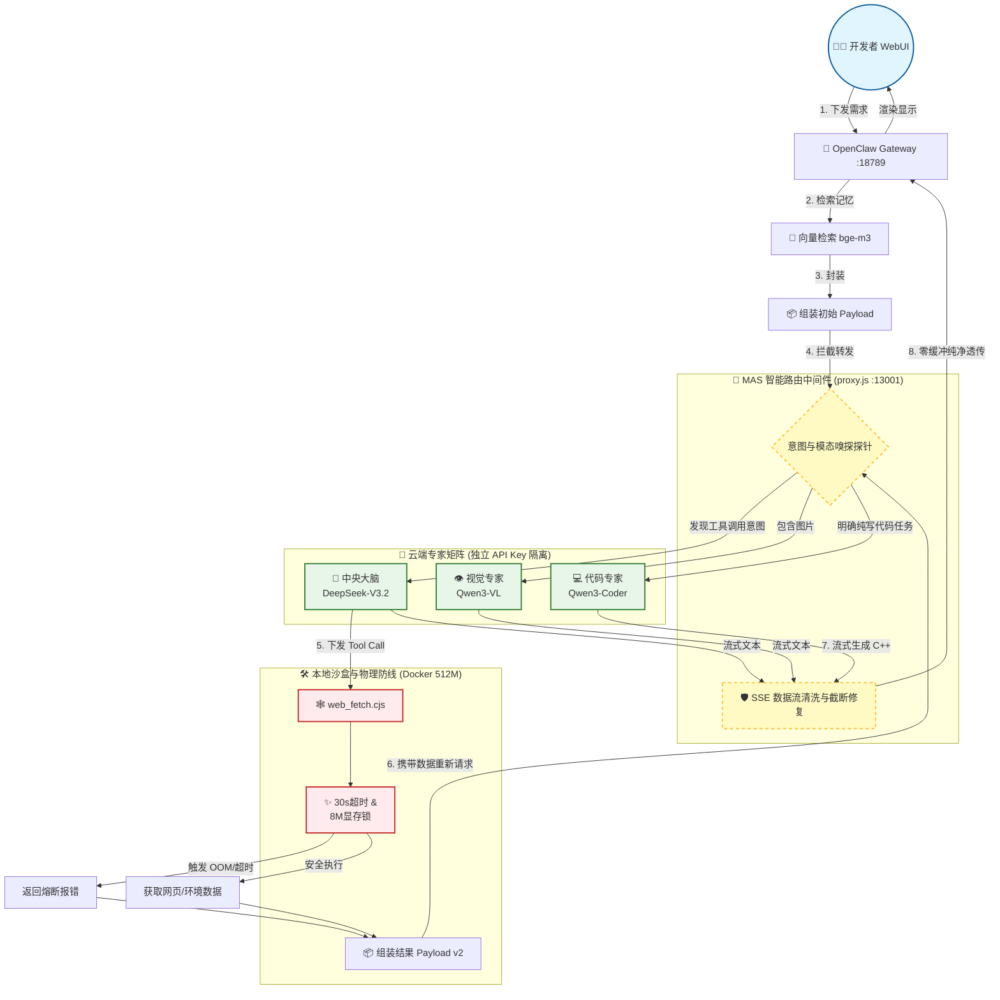

# 🦞 OpenClaw × SiliconFlow 六模型专家矩阵部署方案

[](https://www.docker.com)
[](https://www.microsoft.com/windows/windows-11)
[](https://siliconflow.cn)
[](LICENSE)

本项目提供一套完整的实战部署方案，在 Windows 11 + Docker 环境下运行 OpenClaw，通过自建 **智能路由代理（proxy.js）** 对接 SiliconFlow 平台，实现多模态专家模型（DeepSeek 与 Qwen 系列）的动态分发，并包含严密的物理资源隔离与安全加固措施。

> 本教程记录了真实部署过程中的所有步骤与系统架构调优经验，适合国内开发者参考。

---

## 示意图


## 📑 目录

- [✨ 方案特性](#-方案特性)
- [🖥️ 环境信息](#️-环境信息)
- [📋 前置准备](#-前置准备必看)
- [🚀 部署步骤](#-部署步骤核心-10-步)
- [🎉 部署成功示例](#-部署成功示例)
- [🛑 服务管理](#-服务管理与停止)
- [❗ 常见异常排查指南](#-常见异常排查指南)
- [🔒 安全注意事项](#-安全注意事项)
- [📂 仓库文件说明](#-仓库文件说明)
- [📚 参考资料](#-参考资料)
- [👤 关于作者](#-关于作者)

---

## ✨ 方案特性

相比直接对接单一模型 API，本方案通过底层重构具备以下工程优势：

| 特性 | 说明 |
| --- | --- |
| **多路智能路由** | 根据 Payload 动态分发：常规对话/工具调度 → DeepSeek-V3.2，深度推理 → R1，视觉解析/代码生成 → Qwen 系列专家。 |
| **API 密钥池化隔离** | Text / Tool / Vision / Reason / Code 使用独立 Key 进行计费与限流隔离，彻底解决高并发下的 429 报错瓶颈。 |
| **跨模态数据清洗** | 底层拦截机制：自动剥离进入纯文本模型（如 R1）的图像载荷，防止上下文解析引发的 400 崩溃。 |
| **系统级资源熔断** | 代理容器硬性锁死 512MB 内存防 OOM；外围抓取工具（web_fetch）加入 30 秒 AbortController 超时防挂起策略。 |
| **全环境变量化** | 零硬编码，所有密钥通过 `.env` 安全注入。 |

---

## 🖥️ 环境信息

| 项目 | 详情 |
| --- | --- |
| **操作系统** | Windows 11 Home China 25H2 64位 |
| **处理器** | AMD Ryzen 9 7945HX 十六核 |
| **内存** | 16GB DDR5 5200MHz |
| **显卡** | NVIDIA GeForce RTX 5070 Ti Laptop GPU (12GB) |
| **Docker** | Docker Desktop（[www.docker.com](https://www.docker.com)） |
| **AI 模型** | DeepSeek (V3.2/R1) / Qwen3 (VL/Coder) / BAAI (bge-m3/reranker) |

---

## 📋 前置准备（必看）

### 1. 开启 Windows 虚拟化与 WSL2

在 Windows 11 上运行 Docker 强依赖 WSL2：

1. 在 BIOS 中开启 CPU 虚拟化（任务管理器 → 性能 → CPU → 虚拟化：已启用）
2. 以管理员身份运行 PowerShell，执行以下命令后**重启电脑**：

```powershell
wsl --install
```

### 2. 安装 Git 和 Docker Desktop

- Git：[git-scm.com](https://git-scm.com)
- Docker Desktop：[docker.com](https://www.docker.com)，安装时勾选 "Use WSL 2 based engine"

### 3. 获取 SiliconFlow API Key

前往 [SiliconFlow 控制台](https://cloud.siliconflow.cn/account/ak) 注册并创建 API Key。

为了实现多路并发隔离，建议创建 **多个独立的 Key**，分别配置于 `.env` 中：
- 通用文本与工具调度 (Text & Tool)
- 视觉与代码专家 (Vision & Code)
- 深度推理专家 (Reason)
- 向量嵌入记忆 (Embed)

> 独立 Key 的好处：单一业务（如网络爬虫工具调用）触发频率限制时，不会导致主对话流瘫痪；且发生泄露时可单独吊销。

---

## 🚀 部署步骤（核心 10 步）

### 第一步：配置 Git 代理（国内网络可选）

```powershell
git config --global http.proxy [http://127.0.0.1:10808](http://127.0.0.1:10808)
git config --global https.proxy [http://127.0.0.1:10808](http://127.0.0.1:10808)
```

### 第二步：克隆 OpenClaw 仓库

```powershell
cd D:\AI
git clone --depth 1 [https://github.com/openclaw/openclaw](https://github.com/openclaw/openclaw)
cd openclaw
```

### 第三步：将本仓库文件覆盖到 openclaw 目录

```powershell
# 克隆本仓库部署模板
git clone [https://github.com/Syysean/openclaw-expert-matrix](https://github.com/Syysean/openclaw-expert-matrix) D:\AI\openclaw-deploy

# 覆盖核心网关、编排文件与环境变量
Copy-Item D:\AI\openclaw-deploy\proxy.js D:\AI\openclaw\proxy.js -Force
Copy-Item D:\AI\openclaw-deploy\docker-compose.yml D:\AI\openclaw\docker-compose.yml -Force
Copy-Item D:\AI\openclaw-deploy\.env.example D:\AI\openclaw\.env.example -Force

# 部署沙盒安全配置与加固版工具库
Copy-Item D:\AI\openclaw-deploy\config D:\AI\openclaw\ -Recurse -Force
mkdir -p D:\AI\openclaw\workspace\tools
Copy-Item D:\AI\openclaw-deploy\custom_tools\* D:\AI\openclaw\workspace\tools\ -Recurse -Force
```

### 第四步：配置环境变量

复制模板并填写真实值：

```powershell
Copy-Item .env.example .env
notepad .env
```

需要填写的关键变量：

```bash
# Gateway 认证 token（用下面命令生成）
# openssl rand -hex 24
OPENCLAW_GATEWAY_TOKEN=你生成的随机token

# SiliconFlow 多路独立鉴权 Key
SILICONFLOW_TEXT_API_KEY=sk-...
SILICONFLOW_TOOL_API_KEY=sk-...
SILICONFLOW_VISION_API_KEY=sk-...
SILICONFLOW_REASONING_API_KEY=sk-...
SILICONFLOW_CODE_API_KEY=sk-...
SILICONFLOW_EMBED_API_KEY=sk-...

# 网页抓取工具可选配置
JINA_API_KEY=jina_...
```

> 🔴 **注意**：变量名和等号前后**绝对不能有空格**，否则 Key 读取失败。

### 第五步：构建 Docker 镜像

```powershell
docker build -t openclaw:local .
```

> ⏳ 若遇到 `unexpected EOF` 是网络中断，重跑即可。

### 第六步：启动所有容器

```powershell
docker compose up -d
docker compose ps
```

看到所有服务 `STATUS: Up` 说明启动成功。

验证 proxy 智能路由是否正常挂载：

```powershell
docker compose logs siliconflow-proxy
```

应看到类似如下系统初始化日志：
```text
[proxy] ══════════════════════════════════════
[proxy] Smart routing proxy on :13001 (Coordinator Phase 1)
[proxy] ──────────────────────────────────────
[proxy]  中央大脑 (text/tool) -> Pro/deepseek-ai/DeepSeek-V3.2
[proxy]  视觉专家 (vision)   -> Qwen/Qwen3-VL-32B-Instruct
[proxy]  推理专家 (reason)   -> Pro/deepseek-ai/DeepSeek-R1
[proxy]  代码专家 (code)     -> Qwen/Qwen3-Coder-30B-A3B-Instruct
[proxy] ──────────────────────────────────────
```

### 第七步：运行配置向导

```powershell
docker compose run --rm openclaw-cli configure
```

按向导依次选择：

| 选项 | 选择 |
| --- | --- |
| Gateway 位置 | Local (this machine) |
| 配置项目 | Gateway |
| Gateway port | 18789 |
| Gateway bind mode | **LAN (All interfaces)** |
| Gateway auth | Token |
| Tailscale exposure | Off |
| Gateway token | 填入 .env 里的 OPENCLAW_GATEWAY_TOKEN |

### 第八步：健康检查

```powershell
docker compose run --rm openclaw-cli health
```

看到 `Gateway: reachable` 说明配置成功。

### 第九步：测试终端对话

```powershell
docker compose run --rm openclaw-cli agent --session-id test01 -m "你好，请调用代码专家写一段简单的C++代码"
```

### 第十步：访问网页界面并批准设备

1. 浏览器打开 `http://localhost:18789`
2. 填入 Gateway Token，点击连接
3. 首次连接需批准设备：

```powershell
# 查看待批准设备
docker compose run --rm openclaw-cli devices list

# 批准设备（替换为实际 ID）
docker compose run --rm openclaw-cli devices approve <requestId>
```

---

## 🎉 部署成功示例

### 终端对话


### 网页界面


---

## 🛑 服务管理与停止

```powershell
# 停止并保留数据
docker compose stop

# 停止并移除容器
docker compose down

# 查看实时日志
docker compose logs -f

# 只看 proxy 路由日志
docker compose logs -f siliconflow-proxy
```

---

## ❗ 常见异常排查指南

本系统涉及多容器编排与云端 API 通信，发生异常时请按以下分类进行排查：

<details markdown="1">
<summary><b>🔥 点击展开查看完整排障档案</b></summary>

#### [容器与镜像级异常]
**1. `pull access denied for openclaw`**
- **现象**：Docker 引擎尝试从远端拉取镜像失败。
- **排障**：官方核心引擎尚未提供公共构建，必须在本地执行 `docker build -t openclaw:local .` 完成本地镜像编译。

**2. 容器频繁退出 `OOMKilled` 或 `Exit Code 137`**
- **现象**：网关容器突然死亡并重启。
- **排障**：系统成功防御了内存溢出。通常是因为发送了未经压缩的超大载荷（如>10MB图像）击穿了 `512MB` 的内存物理限制。建议使用附带的 `ask_vision.cjs` 进行前端拦截。

#### [网络与网关路由异常]
**3. `[proxy] request error: client disconnected`**
- **现象**：网关或云端主动释放了连接。
- **排障**：若偶发，此为 Node.js 正常的长连接 (Keep-Alive) 生命周期结束；若大面积报错且伴随 502，说明你的 API Key 触发了上游服务商的速率限制 (Rate Limit)，建议增加 Key 池数量。

**4. `LLM request timed out`**
- **现象**：代理网关上游响应超时。
- **排障**：通过 `docker compose logs siliconflow-proxy` 查看路由网关日志。通常是上游 SiliconFlow 服务器拥堵，或本地网关容器未正常启动。

**5. `ERR_EMPTY_RESPONSE` / `non-loopback Control UI requires...`**
- **现象**：UI 面板拒绝跨域或网关回源失败。
- **排障**：网关绑定为局域网 (LAN) 时，必须在 `openclaw.json` 中配置 `dangerouslyAllowHostHeaderOriginFallback: true` 以允许跨域源站校验。

#### [认证与权限异常]
**6. `SILICONFLOW_DEEPSEEK_API_KEY is not set` / 启动报错**
- **现象**：系统检测到认证凭据未注入。
- **排障**：检查 `.env` 文件。确保多个 `SILICONFLOW_*` 变量名拼写正确，且**等号前后绝对不能有空格**（这会导致环境变量解析异常）。

**7. `Verification failed: status 402`**
- **现象**：上游模型路由寻址成功，但拒绝服务。
- **排障**：上游云服务商 (SiliconFlow) 配额耗尽，请前往控制台补充算力余额。

**8. `gateway token mismatch` / `unauthorized: gateway token missing`**
- **现象**：鉴权握手失败。
- **排障**：网页端或 `.env` 中输入的 Token 与沙盒配置库 (`openclaw.json`) 中记录的不一致。请重新运行 `configure` 向导覆写配置。

**9. `pairing required`**
- **现象**：边缘设备未授权接入。
- **排障**：新的终端（如浏览器）首次连接需执行设备签权：使用 `devices list` 查看挂起请求，并使用 `devices approve <id>` 批准。

#### [文件与配置异常]
**10. `Missing config`（Gateway 一直重启）**
- **现象**：配置文件初始化异常。
- **排障**：本仓库的 `docker-compose.yml` 已通过附加 `--allow-unconfigured` 参数解决此问题，请确保使用的是最新编排文件。

**11. `ERR_CONNECTION_REFUSED` (Gateway 容器彻底崩溃)**
- **现象**：核心服务拒绝连接。
- **排障**：极大概率是手写 `openclaw.json` 时破坏了严格的 JSON 语法规范（如漏掉逗号）。使用 JSON 校验工具修复后重启容器。

**12. `404 status code (no body)`**
- **现象**：Agent 路由寻址失败。
- **排障**：确认 `openclaw.json` 中的 `model` 字段值指向了正确的供应商接口（应为 `siliconflow/deepseek`）。

**13. `SILICONFLOW_API_KEY is not set` (单 Key 报错)**
- **现象**：路由网关版本陈旧。
- **排障**：你仍在运行旧版的“单 Key 路由”脚本。请用本仓库最新的 `proxy.js`（多路独立路由版）覆盖，并重启 proxy 容器。

**14. 僵尸工具进程永久挂起**
- **现象**：调用 `web_fetch` 等外部工具时系统卡死。
- **排障**：检查是否未覆盖使用 `custom_tools/` 目录下的安全脚本。加固版脚本已内置 30 秒强制超时熔断锁。

</details>
<br>

## 🔒 安全注意事项

1. **绝对不要**将 `.env` 上传至 GitHub（`.gitignore` 已过滤该文件）。
2. 本方案通过 `config/openclaw.json` 强制开启了 `sandbox: non-main`，限制非主私聊环境下的系统级指令执行权限。
3. Gateway Token 泄露后请重新生成，更新 `.env` 后重启网关服务：
   ```powershell
   docker compose restart openclaw-gateway
   ```

---

## 📂 仓库文件说明

```text
├── proxy.js              # 核心路由引擎：实现多模态模型分发、SSE流截断修复与跨模态数据清洗
├── docker-compose.yml    # 容器编排：定义环境变量映射与 OOM 资源硬限制
├── .env.example          # 环境变量模板（六路密钥隔离池配置）
├── config/
│   └── openclaw.json     # 全局安全配置策略（定义沙盒运行级别）
├── custom_tools/
│   ├── web_fetch.cjs     # 防挂起模块：封装 30s AbortController 超时熔断
│   └── ask_vision.cjs    # 显存保护模块：封装 8MB Payload 拦截锁
└── images/               # 文档静态资源
```

### proxy.js 路由漏斗流转逻辑

```text
Incoming Request -> [Payload Inspector]
    │
    ├─ 匹配专家标识 (reason/code/vision) ──→ 专家模型直连通道 (专属 API Key)
    │
    ├─ 检测到工具调度 (tools 数组存在) ───→ DeepSeek-V3.2 (TOOL_KEY 独立计费池)
    │
    └─ 常规纯文本请求 (Default) ─────────→ DeepSeek-V3.2 (TEXT_KEY 通用池)
```

---

## 📚 参考资料

- [OpenClaw 官方文档](https://docs.openclaw.ai)
- [SiliconFlow API Reference](https://docs.siliconflow.cn)
- [Node.js Streams API](https://nodejs.org/api/stream.html)
- [Docker Compose 资源控制规范](https://docs.docker.com/compose/compose-file/deploy/#resources)

---

## 👤 关于作者

**湖南工商大学 机器人工程专业 本科在读**

专注于嵌入式系统底层控制、软硬件协同架构开发以及具身智能代理模型的本地化工程部署实践。

欢迎提交 [Issue](https://github.com/Syysean/openclaw-expert-matrix/issues) 或 PR 进行技术交流探讨。
